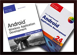

#  triviaquizserver

###### Open Source code for game server for book example

## Sam's Teach Yourself Android Application Development in 24 Hours

 Code for google app engine server used in the book Sams Teach Yourself Android Application Development in 24 Hours.

It's small and briefly put together. It's use is to support the network sections of the application built as part of the book.

## Android Wireless Application Development, 2nd Edition

 Coming here from Android Wireless 
Application Development, Second Edition, B&N version? You've come to the right place. This server code is used for the PeakBagger sample application.

## Upcoming: Learning Kindle Fire Development

A similar server to that used above, also hosted here and deployed via Google App Engine. Coming soon
